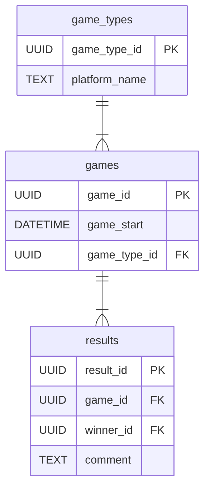

# tournaments-game-creator

# Возможности сервиса:
- CRUD-операции над играми (игры как сессии)
- CRUD-операции над результатами (результаты эти игр, есть возможность указать нескольких победителей)

_____________

# !!!
## В ходе разработки было принято решение изменить некоторые id сущностей с INT на UUID
## Миграции сделаны с помощью Liquibase, репозиторий с базой данных скрыт
